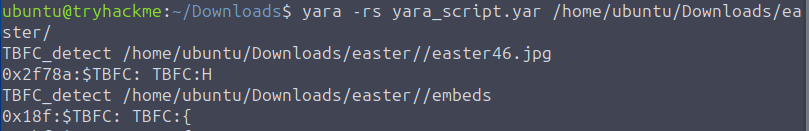

# ROOM 13 - YARA Rules - YARA mean one! (httpbnry)

### Scenario Summary

When McSkidy went missing, The Best Festival Company (TBFC) faced chaos and uncertainty. Despite her disappearance, McSkidy attempted to assist the TBFC blue team by sending a set of seemingly harmless images from an anonymous location. Although the images appeared related to Easter preparations, they secretly contained a hidden message.

Using principles from the crisis communication process, the message was embedded across a folder of images and can only be decoded by identifying a specific **keyword followed by a code word**. To uncover the message, the blue team must create a **YARA rule** that scans the image directory and triggers on these patterns. By extracting the detected code words and sorting them in ascending order, the team can reconstruct McSkidy’s message.

### Learning Objectives

- Understand the basic concept of YARA  
- Learn when and why YARA rules are used  
- Explore different types of YARA rules  
- Learn how to write YARA rules  
- Practically detect malicious indicators using YARA  

---

In this room we are going to need the **AttackBox**, becauase in `/home/ubuntu/downloads/` theres a folder calles `easter` which we are going to use with the **YARA rules**

---

## WHAT IS YARA

In modern cyber defense, threats often hide in plain sight—disguised as harmless files, documents, or scripts. Defenders are overwhelmed by alerts and anomalies, making it difficult to identify what truly matters. YARA addresses this challenge by allowing defenders to detect malware based on **patterns and behavior**, not just filenames or signatures.

YARA empowers defenders to define their own rules for what constitutes malicious activity. Many rules are also shared by other defenders, enabling teams to reuse, adapt, and strengthen defenses collaboratively. For TBFC and the defenders of SOC-mas, this means faster detection, smarter investigations, and fewer threats going unnoticed.

### When Defenders Use YARA

Common situations where YARA is relied upon include:

- **Post-incident analysis**: Checking if malware traces found on one system exist elsewhere.
- **Threat hunting**: Searching systems and endpoints for known or related malware families.
- **Intelligence-based scans**: Using shared YARA rules to detect new indicators of compromise.
- **Memory analysis**: Inspecting memory dumps for malicious code fragments in active processes.

Defenders often find additional creative uses for YARA during investigations and hunts.

### YARA’s Value to Defenders

YARA provides clarity in chaotic environments by giving defenders direct control over detection. Instead of waiting on external updates or alerts, analysts can act proactively.

Key advantages of YARA include:

- **Speed**: Rapidly scans large datasets and systems.
- **Flexibility**: Matches text, binary patterns, and complex logic.
- **Control**: Allows defenders to define what they consider malicious.
- **Shareability**: Rules can be reused and improved across teams and organizations.
- **Visibility**: Connects scattered indicators into a coherent view of an attack.

Overall, YARA enables defenders to shift from passive monitoring to **active threat hunting**, turning intelligence into action before attackers can strike again.

---
## YARA RULES

To uncover the digital footprints of King Malhare, defenders must understand how YARA rules are structured and evaluated. A YARA rule is composed of three core elements that work together to identify suspicious artifacts.

### Core Elements of a YARA Rule

- **Metadata (meta)**  
  Descriptive information about the rule, such as author, date, and purpose. While optional, metadata is strongly recommended to maintain clarity and manage large rule sets efficiently.

- **Strings**  
  The indicators YARA searches for, including text, byte patterns, or regular expressions that signal malicious activity.

- **Conditions**  
  Logical expressions that determine when a rule should trigger based on matched strings or file properties.

### Example YARA Rule

```yara
rule TBFC_KingMalhare_Trace
{
    meta:
        author = "Defender of SOC-mas"
        description = "Detects traces of King Malhare’s malware"
        date = "2025-10-10"
    strings:
        $s1 = "rundll32.exe" fullword ascii
        $s2 = "msvcrt.dll" fullword wide
        $url1 = /http:\/\/.*malhare.*/ nocase
    condition:
        any of them
}
```
In this example we can see that the meta section contains fields like `author`, `description` and `date`. These are not required but recommened, because they help us understand what the rule is about, who created it and when it was written.

Then we have the **Strings** section, where we can define the actual clues, text, byte sequences, or regular expressions that **YARA** should search for. 

Then the **condition** that tells **YARA** when to flag a match. In the example, any of them.

Lets investigate **Strings and Conditions** more closely.

---

## STRINGS

Text strings are the simplest and most common used type in **YARA rules**. They represent words or short text fragments that might appear in a file, script, or memory. By default YARA treats text strings as ASCII and case sensitive, but we can modify this.

Small keywords are added to the string definition to modify how they behave.

- Case-Insensitive strings - `nocase`

```yara
strings:
  $xmas = "Christmas" nocase
```

The added `nocase` modifier makes the match ignore letter casing so "Christmas" and "CHRISTMAS" will also trigger the same result.

- Wide-Character strings - `wide`, `ascii`

This will tell YARA to look for the **two-byte Unicode Characters** (used in many windows executables). using `ascii` will enforce a **single-byte** search

- XOR strings - `xor`

Some cases, people will use XOR-encode text to hide it from scanners, using the `xor` modifier, YARA will check all possible single-bye XOR variations of a string.

```yara
strings:
  $hidden = "Example" xor
```

- Base64 Strings - `base64`, `base64wide`

Some malware encodes payloads or commands in base64. With these modifiers, YARA will decode de content for the original pattern.

---

## HEXADECIMAL STRINGS

Sometimes code isnt readable, and hides itlsef in raw bytes inside executables or memory. This is when hexadecimal strings come foward. **Hex Strings** allow **YARA** to search for specific byte patterns, written in hexadecimal notation.

This is useful when defenders need to detect malware fragments like **file headers, shellcode, or binary signatures** that cant be represented as plain text.

```yara
rule TBFC_Malhare_HexDetect
{
    strings:
        $mz = { 4D 5A 90 00 }   // MZ header of a Windows executable
        $hex_string = { E3 41 ?? C8 G? VB }

    condition:
        $mz and $hex_string
}
```
---

## REGULAR EXPRESSION STRINGS

Sometimes the malware does not always follow a fixed pattern. Small changes in filenames, URLs, or commands can make detection with plain text or hex strings unreliable. **Regular expressions (regex)** solve this problem by allowing defenders to define flexible patterns that match multiple variations of the same malicious behavior.

Regex strings are especially useful for identifying:
- Malicious URLs with changing paths or domains
- Encoded or obfuscated command-line instructions
- Filenames that follow a consistent structure but vary slightly

By using regular expressions in YARA rules, defenders can detect evolving threats more effectively, even when attackers attempt to evade signature-based detection through minor mutations.

```yara
rule TBFC_Malhare_RegexDetect
{
    strings:
        $url = /http:\/\/.*malhare.*/ nocase
        $cmd = /powershell.*-enc\s+[A-Za-z0-9+/=]+/ nocase

    condition:
        $url and $cmd
}
```
---

### CONDITIONS 

## Conditions in YARA

After defining **what to look for** using strings, defenders must decide **when a threat is confirmed**. This logic is defined in the **condition** section—the core decision-making component of every YARA rule. Conditions evaluate matched strings and file properties to determine whether a rule should trigger, signaling the presence of King Malhare’s code.

-  Match a Single String
The simplest condition triggers when one specific string is found.

```yara
condition:
    $xmas
```
- Match Any String
Triggers when any one of the defined strings matches.

```
condition:
    any of them
```
Useful for early detection, where even one indicator may warrant investigation.

- Match All Strings
Triggers only when all defined strings are found together.
```yara
condition:
    all of them
```
This stricter approach helps reduce false positives.

- Combine Logic with and, or, not
Logical operators allow defenders to fine-tune detection logic.
```yara
condition:
    ($s1 or $s2) and not $benign
```
This condition detects suspicious indicators while excluding known harmless patterns.

- Use File Property Comparisons
YARA can evaluate file attributes such as size, entry point, or hash.
```yara
condition:
    any of them and (filesize < 700KB)
```
This triggers when a string match occurs in a file with suspicious characteristics.

---

## CHALLENGE

Now we have to write our on **YARA RULE** where we have to search for the keyword `TBFC:`, followed by an ASCII alphanumeric keyboard across the `/home/ubuntu/Downloads/easter` directory to extract the message sent by *McSkidy*.

lets start, so first we create the script:

```yara
rule room13
{
	strings:
		$TBFC_string = /TBFC:./ nocase
	
	condition:
		$TBFC_string
}
```
This will search for any string with `TBFC:` followed by an ASCII Alphanumeric keyword (`.`).

To especify where lets create the command.

`yara -rs /home/ubuntu/Downloads/easter`

Lets try it out!!

In the Attackbox, we start a terminal and head to `/home/ubuntu/Downloads/` (`cd /home/ubuntu/Downloads/`)

In there, we create a YARA file with nano (`nano yara_rule.yar`)

Then we enter our script created before and run the command.


> This only contains part of the output.

Ok so it worked, but its only showing us 1 letter after `TBFC:`. 

With this information we can still answer to **Question 1**.

---

Ok after some testing, ive figured out that my first script is wrong, especially the regex part.

The script asks for **a string that BEGINS with TBFC: followed by ONE OR MORE alphanumeric ASCII characters**

so the right regex would be:
```
<details>
  <summary>Click to reveal spoiler</summary>
  ```yara
  /TBFC:[a-zA-Z0-9]+/
  ```
  </summary>
</details> 
```
```
`TBFC:`
Matches the exact required prefix.

`[A-Za-z0-9]+`
Requires one or more alphanumeric ASCII characters after the prefix.
This avoids matching empty values or symbols.

This answers **Question 2**.

---

After applying the 2nd Regex to the script and running it, we get a Phrase that when ordered by image num we get the answer for **Question 3**.

---

## SUMMARY / FEEDBACK

- I really love this room, it lets us create our own script, and gives us all the information we need to succesfully do it.

