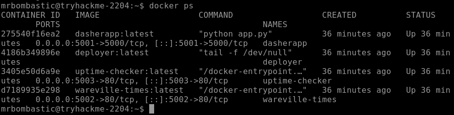
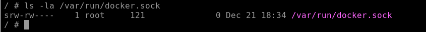
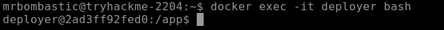

# ROOM 14 - Containers - DoorDashers Demise (httpbnry)

The context of this room is the following:

As the sun rose over Wareville, chaos struck once again. DoorDasher, the town’s beloved local food delivery service and a favorite among workers at The Best Festival Company, was overtaken by King Malhare and his bandit bunny battalions. Overnight, the platform was rebranded as **Hopperoo**, with menu items mysteriously altered.

Trouble escalated when residents reported choking incidents caused by what turned out to be **fragments of Santa’s beard** replacing noodles. The Health & Safety Food Bureau confirmed multiple incidents, including one case of “accidental facial hair synchronisation,” sparking widespread backlash now known as **Beardgate**.

A DoorDasher security engineer prepared a script to restore the service, but was locked out by Sir CarrotBaine before it could be executed. With all seeming lost, the SOC team discovered they still had access through a **monitoring pod (uptime checker)**.

### Your Mission
As a SOC team member, your task is to:
- Escape the container
- Escalate privileges
- Restore DoorDasher to its original state

### Learning Objectives
- Understand containers and Docker concepts (images, layers, container engine)
- Explore Docker runtime internals (sockets, daemon API)
- Identify and exploit common container escape and privilege escalation techniques
- Investigate image layers and recover a compromised service

---

For this room we are going to need to use **AttackBox**. We will need this to also access the user `bombastic` in the Ubuntu 22.04

---

## What Are Containers?

Modern applications are often complex, leading to common challenges:
- **Installation issues** caused by environment-specific configuration quirks  
- **Troubleshooting difficulties** when it’s unclear whether failures stem from the app or its environment  
- **Dependency conflicts**, such as needing multiple versions of the same software  

The key solution to these problems is **isolation**. Containerisation packages an application together with all its dependencies into a single isolated unit called a **container**, ensuring it runs consistently across environments.

### Why Containers?
- Applications behave the same regardless of where they run
- Easier troubleshooting and deployment
- Extremely **lightweight** compared to other virtualisation methods

---

## Containers vs Virtual Machines (VMs)

- **Virtual Machines** run on a hypervisor and include a full guest operating system.  
  - Heavier, slower to start, but fully isolated  
  - Ideal for running different operating systems or legacy software  

- **Containers** share the host OS kernel and isolate only the application and its dependencies.  
  - Lightweight and fast  
  - Ideal for scalable, portable services  

---

## Applications at Scale: Microservices

Modern applications increasingly use a **microservices architecture**, breaking a large monolithic app into smaller services based on business function. This allows:
- Independent scaling of high-demand components  
- Faster deployment and updates  

Containers are perfect for this model due to their lightweight and scalable nature, which is why they’ve become widely adopted over the past decade.

---

## Container Engines and Docker

A **container engine** builds, runs, and manages containers using OS kernel features like namespaces and cgroups.

- **Docker** is a popular open-source container engine
- Uses **Dockerfiles** (text-based build instructions) to define environments and dependencies
- Ensures applications run consistently across systems  

Docker is the container engine used by **DoorDasher** and will be the focus of the interactive lab.

---

## Container Escapes & Runtime Sockets

A **container escape** occurs when code running inside a container gains access to the host system or other containers.

- Containers operate using a **client–server model**
- CLI tools communicate with the container daemon via an **API exposed through Unix sockets**
- If an attacker gains access to this socket from inside a container, they can:
  - Control the container runtime
  - Create privileged containers
  - Potentially escape isolation and access the host system  

Understanding these mechanisms is key to identifying and exploiting container escape and privilege escalation vulnerabilities.

---

# CHALLENGE

Our challenge is to investigate Dockers Layers and restore the defaced website to its original service.

## ACCESS POINTS

Ok first we are going to work with `bombastic` in *Ubuntu 22.04*. 

Lets see what services are running with docker.

`docker ps`

We can see that:

1. The main service runs at `http://MACHINE_IP:5001`, its a tcp port for a "*Dasherapp*"
2. Theres a container called **uptime-checker**.

Lets explore the **uptime-checker** container with the `docker exec` command

`docker exec -it uptime-checker sh`

This command opens a interactive shell inside a running Docker conatiner (in our case `uptime-checker`)

- `-it` Keeps STDIN open so you can type commands and Allocates a terminal so it behaves like a real shell
- `sh` The command to execute inside the container. 

So now we are **inside the containers filesystem and namespace**.

After running that command, we can see a interactive shell with `/ #`

Lets try `ls -la` to see what directories and archives are there.

As we can see, we can see the conatiners files.

Now, the room tells us to check **the docker socket** in `/var/run/docker.sock`

so we `ls -la /var/run/docker.sock`

By default, Docker enables Enhanced Container Isolation, which prevents containers from accessing the Docker Engine directly. This is important because access to the Docker Engine effectively means root-level control over the host.

But as we can see:

We have access to this file, meaning we can use it to our advantage since we can create new containers, start priviledged containers, etc..

Lets check `docker ps` again, knowing we can perform a docker escape attack.

Now we are going to enter the `deployer` container, which is a priviledged container.

we do this via the command `docker exec -it deployer bash`

This command is like the other one, but we use bash.

As we can see we are in the deployer conatiner in the `/app` directory.

Lets see who we are with `whoami`

We can see we are deployer, lets explore the filsystem in search of a flag.

We find a flag in the `/` direcotory (`flag.txt`).

---

Now to recover the website, in the `/` directory, theres a `recovery_script.sh`, that recovers the defaces website.

Lets run it via:

`./recovery_script.sh`

This will Recover the site.

---

## BONUS QUESTION

Ok now, theres a bonus question hinting us at a clue in a webpage in port `5002`, this secret code is also deployer's password.

Ok by inspecting the page, theres 3 words highlighted in red, when put toguether they become **DeployMasterxxxx!** (this is not the entire password)

Lets put that as an answer.

It worked!!

---

## SUMMARY/FEEDBACK

- this was was really simple, but interesting.

