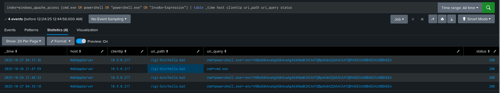

# ROOM 15 - Web Attack Forensics - Drone Alone

The **context of this room** is the following:

*TBFC’s drone scheduler web UI is exhibiting suspicious behavior involving unusually long HTTP requests containing Base64-encoded data. Splunk has raised an alert indicating that Apache spawned an unusual process. Investigation reveals that on certain vulnerable endpoints, these malicious requests trigger execution of obfuscated shell code hidden within the Base64 payloads*

*As a Blue Team analyst, your task is to triage this incident, identify compromised hosts, extract and decode the malicious payloads, and determine the overall scope of the compromise.*

The investigation will be conducted using Splunk, pivoting between:
- **Apache web logs** (access and error logs) to analyze malicious HTTP activity
- **Sysmon telemetry** to track host-level process execution and attacker behavior

Each step of the investigation aligns with a specific Splunk query and analysis goal.

---

## Learning Objectives

- Detect and analyze malicious web activity using Apache access and error logs  
- Investigate attacker actions at the OS level using Sysmon data  
- Identify, extract, and decode obfuscated or Base64-encoded payloads  
- Reconstruct the full attack chain using Splunk as a Blue Team investigation tool  


---

Lets start the **Target Machine**, which will allow us to access the **Splunk Dashboard** at `port 8000` in `http://MACHINE_IP:8000`.

---

## Step 1: Detect Suspicious Web Commands in Apache Access Logs

I began by searching the Apache access logs for signs of command injection attempts. My goal was to identify HTTP requests that tried to execute system commands via the web server.

> You have to go to the 'Search and Reporting` Tab.

```spl
index=windows_apache_access (cmd.exe OR powershell OR "powershell.exe" OR "Invoke-Expression")
| table _time host clientip uri_path uri_query status
```

From the results, i focused on usually long parameters and **Base64-encoded** strings, which are used to hide *Powershell Commands*.

> I also put the time range to "All time".



I copied one encoded string I found:

`VABoAGkAcwAgAGkAcwAgAG4AbwB3ACAATQBpAG4AZQAhACAATQBVAEEASABBAEEASABBAEEA`

I decoded it using `https://www.base64decode.org` , which revealed the attacker’s hidden command. This confirmed that obfuscation was being used to conceal malicious intent.

The decoded code is in the `decoded_code.txt` file.

> i used the **base65** command to decode it via `base64 -d code.txt > decoded_code.txt`

---

## Step 2: Check Apache Logs for Execution Failures.

Next lets review the apache logs to determine wether the malicious requests reached the backend and triggered any execution attempts.

So we insert the following search query:

`index=windows_apache_error ("cmd.exe" OR "powershell" OR "Internal Server Error")`

I switched the event view to Raw to see the full error details.

I noticed requests such as:

`/cgi-bin/hello.bat?cmd=powershell`

That resulted in **500 Internal Server Error** responses. This suggested that the server attempted to process the command but failed during execution — a strong indicator of exploitation attempts rather than simple probing.

---

Step 3: Trace Suspicious Process Creation from Apache (Sysmon)

To confirm whether Apache successfully executed system-level commands, I pivoted to Sysmon logs and looked for child processes spawned by Apache.

index=windows_sysmon ParentImage="*httpd.exe"


I switched the view to Table for easier analysis.

Here, I found highly suspicious activity where:

ParentImage was C:\Apache24\bin\httpd.exe

Image was C:\Windows\System32\cmd.exe

Apache should never spawn command shells under normal circumstances. This was clear evidence of a successful command injection that reached the operating system.

Step 4: Confirm Attacker Enumeration Activity

After confirming code execution, I checked whether the attacker performed basic post-exploitation enumeration.

index=windows_sysmon *cmd.exe* *whoami*


The presence of whoami confirmed that the attacker was checking the execution context and user privileges — a common first step after gaining command execution on a system.

---

## Step 5: Identify Base64-Encoded PowerShell Payloads

Finally, I searched for encoded PowerShell commands in Sysmon logs to determine whether any obfuscated payloads actually executed.

`index=windows_sysmon Image="*powershell.exe" (CommandLine="*enc*" OR CommandLine="*-EncodedCommand*" OR CommandLine="*Base64*")`


Ideally, this query should return no results, indicating that encoded payloads were blocked or never executed. If results were present, I would decode the Base64 commands to fully understand the attacker’s objectives.

---

## SUMMARY / FEEDBACK

- These are not my type of rooms, i find them very boring, but its intereseting.


