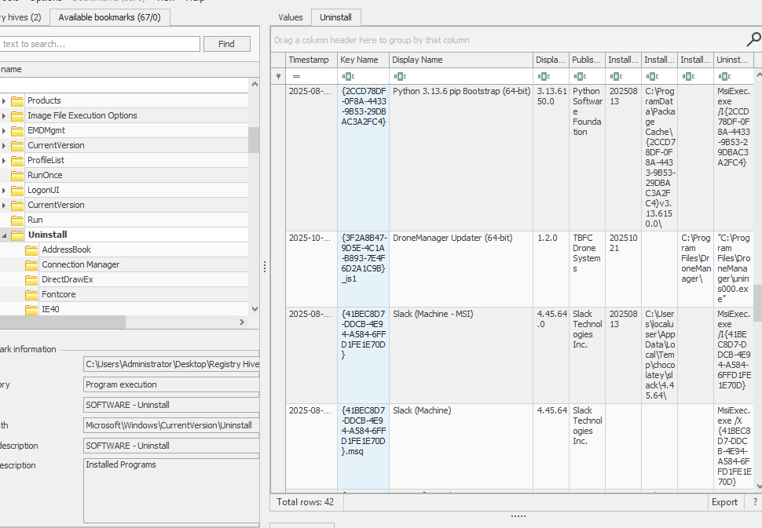
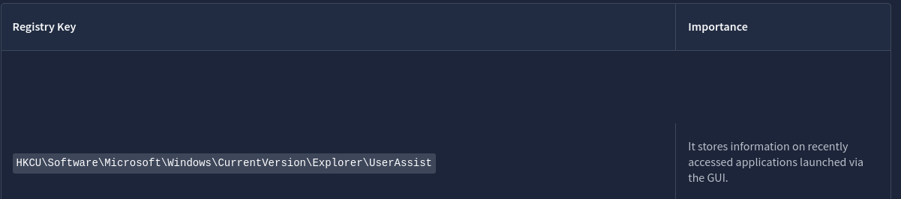

# ROOM 16 - Registry - Registry Furensics

TBFC is under active attack, with multiple systems showing unusual behavior. The organization is feeling the absence of its lead defender, **McSkidy**, but her well-trained team is carrying on her legacy.

With the critical event **SOCMAS** approaching, the team is racing to secure systems and restore control. One of the most vital systems, **dispatch-srv01**, which coordinates drone-based gift deliveries, has been compromised by **King Malhare’s bandits of bunnies**.

## Investigation Focus

The defenders have split into specialized forensic teams to analyze different artefacts such as:
- System logs 
- Memory dumps 
- File systems 

Your role is to investigate the **Windows Registry** of the compromised system.

## Learning Objectives

- Understand what the **Windows Registry** is and what it contains  
- Explore **Registry Hives** and **Root Keys**  
- Analyze Registry Hives using the **Windows Registry Editor**  
- Perform **Registry Forensics** using the **Registry Explorer** tool  

---

To conect to the machine, we have to start it up. Then, we can connect via **RDP** (Remote Desktop Protocol) or by using the Splitscreen.

In my case im going to use RDP. (**User:** Administrator **Password:** AoC_RegistryForensics456 ).

---

## Understanding the Windows Registry

Just like the human brain stores everything needed for daily functioning—behavior, habits, memories, and routines—the **Windows Operating System** relies on its own “brain” to function properly. This brain is called the **Windows Registry**.

### What Is the Windows Registry?

The Windows Registry is a centralized database that stores:
- System configuration settings  
- User preferences  
- Hardware and software configuration  
- Information required for Windows to operate correctly  

Without it, the OS would not know how to behave or how to load its components.

### Registry Structure: Hives

Unlike the human brain, which exists in one physical location, the Windows Registry is **distributed across multiple files**. These files are known as **Registry Hives**.

Each hive:
- Stores a specific category of configuration data  
- Exists as a separate file on disk  
- Is loaded into memory when needed  

### Registry Hives Overview

The table below (not shown here) typically includes:
- **Hive Name** – The logical name of the registry hive  
- **Stored Configuration Type** – What kind of data the hive contains  
- **Disk Location** – Where the hive is stored on the system  

Understanding these hives is essential for **registry forensics**, as they reveal system behavior, user activity, and potential signs of compromise.

## Windows Registry Hives Overview

The Windows Registry is composed of multiple files known as **hives**, each responsible for storing specific configuration settings. Below is a summary of the primary registry hives, what they contain, and where they are located on disk.

| Hive Name      | Contains                                                                 | Location                                                                 |
|---------------|--------------------------------------------------------------------------|--------------------------------------------------------------------------|
| **SYSTEM**     | - Services - Mounted Devices - Boot Configuration - Drivers - Hardware | `C:\Windows\System32\config\SYSTEM`                                      |
| **SECURITY**   | - Local Security Policies - Audit Policy Settings                     | `C:\Windows\System32\config\SECURITY`                                    |
| **SOFTWARE**   | - Installed Programs - OS Version and Information - Autostarts - Program Settings | `C:\Windows\System32\config\SOFTWARE`                                    |
| **SAM**        | - Usernames and Metadata - Password Hashes - Group Memberships - Account Statuses | `C:\Windows\System32\config\SAM`                                         |
| **NTUSER.DAT** | - Recent Files - User Preferences - User-Specific Autostarts        | `C:\Users\username\NTUSER.DAT`                                           |
| **USRCLASS.DAT** | - Shellbags - Jump Lists                                             | `C:\Users\username\AppData\Local\Microsoft\Windows\USRCLASS.DAT`         |

> **Note:** The configuration settings listed above are only examples. Each hive contains significantly more data that can be valuable during system analysis and digital forensics.

## Viewing and Analyzing Registry Hives

You now know where the registry hives are stored on disk. However, **double-clicking these files will not work**, as they contain binary data that cannot be read directly. So how can we view their contents?

### Using Registry Editor

Windows provides a built-in tool called **Registry Editor** to view registry data:

1. Open it by typing **Registry Editor** in the search bar.
2. You will see **Root Keys** such as `HKEY_LOCAL_MACHINE` and `HKEY_CURRENT_USER`, rather than the hive names (SYSTEM, SOFTWARE, etc.).
3. Windows organizes the hives into these **structured root keys**, as shown below:

| Hive on Disk   | Registry Editor Location                        |
|---------------|------------------------------------------------|
| SYSTEM        | HKEY_LOCAL_MACHINE\SYSTEM                      |
| SECURITY      | HKEY_LOCAL_MACHINE\SECURITY                    |
| SOFTWARE      | HKEY_LOCAL_MACHINE\SOFTWARE                    |
| SAM           | HKEY_LOCAL_MACHINE\SAM                          |
| NTUSER.DAT    | HKEY_USERS\<SID> and HKEY_CURRENT_USER        |
| USRCLASS.DAT  | HKEY_USERS\<SID>\Software\Classes             |

> **Note:** HKEY_CLASSES_ROOT (HKCR) and HKEY_CURRENT_CONFIG (HKCC) are **dynamic keys**, not backed by separate hive files.

### Extracting Registry Information

Viewing registry data is similar to navigating files in File Explorer. Here are examples:

### Registry Forensics

The registry stores **critical system and user data**. During forensic investigations, analysts examine registry keys to reconstruct events. Some commonly useful forensic keys include:

| Registry Key | Importance |
|--------------|------------|
| HKCU\Software\Microsoft\Windows\CurrentVersion\Explorer\UserAssist | Tracks recently accessed applications via GUI |
| HKCU\Software\Microsoft\Windows\CurrentVersion\Explorer\TypedPaths | Paths typed in Explorer address bar |
| HKLM\Software\Microsoft\Windows\CurrentVersion\App Paths | Application paths |
| HKCU\Software\Microsoft\Windows\CurrentVersion\Explorer\WordWheelQuery | Explorer search terms |
| HKLM\Software\Microsoft\Windows\CurrentVersion\Run | Startup programs |
| HKCU\Software\Microsoft\Windows\CurrentVersion\Explorer\RecentDocs | Recently accessed files |
| HKLM\SYSTEM\CurrentControlSet\Control\ComputerName\ComputerName | Computer hostname |
| HKLM\SOFTWARE\Microsoft\Windows\CurrentVersion\Uninstall | Installed programs |

> **Important:** Investigations require **offline analysis** to avoid modifying evidence. The built-in Registry Editor cannot open offline hives or parse binary data fully.

### Using Registry Explorer for Forensics

**Registry Explorer** is an open-source forensic tool for offline analysis:

#### Step 1: Launch Registry Explorer
- Click the **Registry Explorer** icon on the taskbar.

#### Step 2: Load Registry Hives
- Go to **File → Load Hive**
- Navigate to `C:\Users\Administrator\Desktop\Registry Hives`
- Select the hive (e.g., SYSTEM)
- **Hold SHIFT** and press Open to include transaction logs, ensuring a clean hive state
- Repeat for all hives

#### Step 3: Investigate Registry Keys
- Example: Find the computer name
  - Path: `ROOT\ControlSet001\Control\ComputerName\ComputerName`
  - Value: `DISPATCH-SRV01`
- Use bookmarks or search to quickly navigate keys

### Practical Forensics

Now that hives are loaded in **Registry Explorer**, you can:

- Analyze system configuration, user activity, and connected devices
- Use the forensic key table for guidance
- Investigate the **abnormal activity** on dispatch-srv01, which started **21st October 2025**

---

**1st Question:** Here we can try to see which app got installed before the date in which the abnormal activity started. 

To do this, we can go to the table de room gave us and we can see that **installed app information** is in the following path:

`HKLM\SOFTWARE\Microsoft\Windows\CurrentVersion\Uninstall`

> Looking at the table we can see that HKLM is **Local Machine**  and its `SOFTWARE`. So we open the `SOFTWARE` Hive Registry.

Then, we click on the `Uninstall` Folder and to the right we see a whole table full of information.

As we can see theres a column named `Display Name` we can order by time stamp and we can see which app got installed BEFORE unusual activity.

**2nd Question:** Full PATH where the user launched the application from.

We can find this information by loading the `NTUSER.DAT` Hive Registry. Why? Because when we look at the table, it tells us:

We can see that it is in the **HKCU** which is the **Current User**. Then we go to the location the table tells us:

`HKCU\Software\Microsoft\Windows\CurrentVersion\Explorer\UserAssist` 

Then we look for the app name **we figured out in question 1** and it will contain the full PATH.

**3rd Question:** Which value was added by the application to maintain persistence on startup?

First of all, we look at the table which tells us that its **HKLM** (Local Machine) --> SYSTEM Hive Registry. 

Then we head to the PATH given to us:

`HKLM\Software\Microsoft\Windows\CurrentVersion\Run`

> This folder appears in the Bookmarks tab also.

Then we will se the app and in the `data` section we will se the data added to maintain persistence on addup. 

---

## REVISION / FEEDBACK

- Really interesting room, i dont know how people memorize all of the files and what goes where, im guessing practice and repetition but damn. 

