# ROOM 17 - Cyberchef - Hoperation Save McSkidy

McSkidy is imprisoned in King Malhare's **Quantum Warren**, a heavily secured fortress guarded by **Sir BreachBlocker III**. Despite strong access controls, McSkidy secretly sends clues hidden within innocent-looking bunny images.

### Key Plot Points
- Five security locks must be disabled to enable an escape.
- Each lock can be broken by analyzing its **logic**.
- The fortress includes a **built-in chat system** used by guards, which can be exploited to reveal sensitive details or passwords.
- Success requires understanding and using the **guards’ language**.

### Learning Objectives
- Understand basic **encoding and decoding** concepts.
- Learn how to use **CyberChef** for data analysis.
- Identify valuable information in web applications via **HTTP headers**.

---

To complete this room we are going to need to start the Target machine.

---

# IMPORTANT CONCEPTS

**Encoding** transforms data to ensure compatibility between systems, while **encryption** protects data confidentiality and security.

| Aspect | Encoding | Encryption |
|-----|--------|-----------|
| Purpose | Compatibility & usability | Security & confidentiality |
| Process | Standardized | Algorithm + key |
| Security | No | Yes |
| Speed | Fast | Slower |
| Examples | Base64 | TLS |

**Decoding** is the reverse process of encoding, converting data back to its original, readable form.

---

## CyberChef Overview

CyberChef, known as the **Cyber Swiss Army Knife**, is a powerful tool for encoding, decoding, and data analysis.

### Key Areas
- **Operations**: Collection of available functions
- **Recipe**: Chain and configure operations
- **Input**: Data to be processed
- **Output**: Result of the recipe

### Simple Example
1. Open CyberChef (online or offline).
2. Drag **To Base64** into the Recipe area.
3. Enter `IamRoot` in the Input area.
4. Add **From Base64** to decode it back.
5. Toggle operations on/off using the middle button.

This demonstrates how operations can be chained together.

---

## Inspecting Web Pages

Web pages include additional data beyond visible content, which can be valuable for analysis.

### Access Developer Tools
- **Chrome**: More tools → Developer tools
- **Firefox**: ☰ → More tools → Web Developer Tools
- **Edge**: Settings and more (…) → More tools → Developer tools
- **Opera**: Developer → Developer tools
- **Safari**: Develop → Show Web Inspector  
  *(Enable Develop menu in Preferences → Advanced)*

**Tip:** Dock the developer console to the right for better visibility.

---

## FIRST LOCK - OUTER GATE

First of all, lets access the web app at `HTTP://MACHINE_IP:8080`. 

Here we can find some vital clues to McSkidy's message.

The room tells us to look out for some **key points**:

- Chat is **Base64 Encoded**.
- Note down the **Guard Names** for each level.
- HTTP **Headers**
- Login Logic in the Debugger Tab

### PRACTICE

So in the webpage, we go to the **1st gate - outer gate**. Where we will find the following:

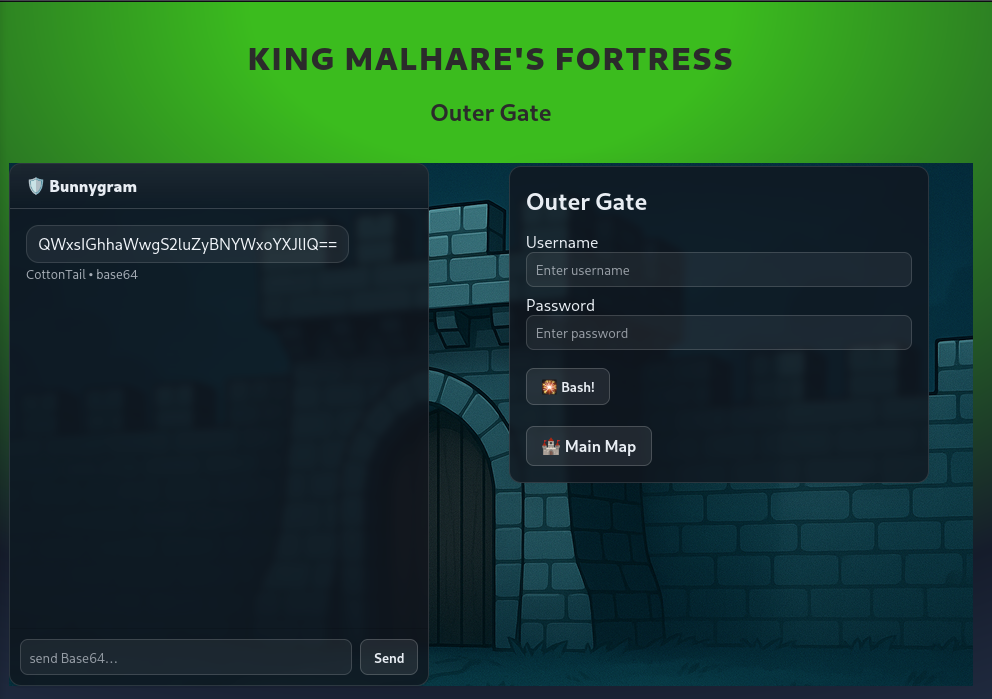

- A chat program encoded with Base64
- A Username and Password prompt.

---

**First of all** lets decode the message in the *Bunnygram*. So lets head to **Cyberchef**, put the message in the input and drag `From Base64` to the **Recipe**. 

Then we can see the decoded message: *"All hail King Malhare!"*

First, if we login, we can see a hint:

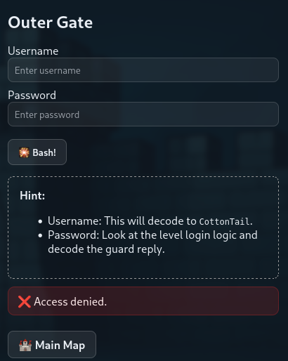

First lets see the **username**, it says it decodes to `CottonTail`. So lets just enter that into **Cyberchef**, and then hitting `To Base64`.

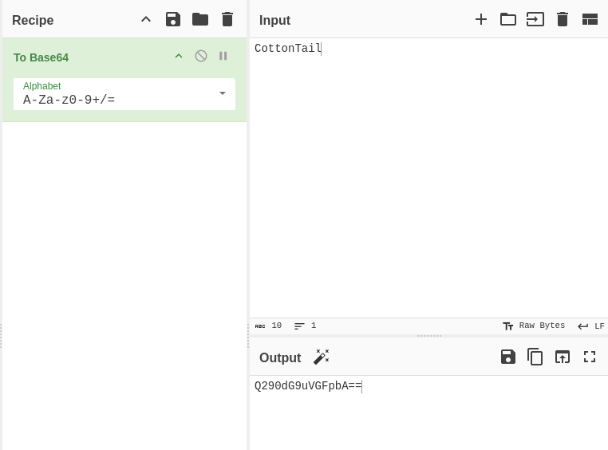

We can copy the output and put it as the **Username**

> **IMPORTANT:** SAVE the encoded output in a file.

**Secondly** lets figure out the **Password**. The room tells us to check out the page **Headers**, so lets head to the Network tab in the DevTools (Right Click the Page --> Inspect --> Network).

When we get there, lets refresh the page and see all the **HTTP requests/responses** (Network requests). 

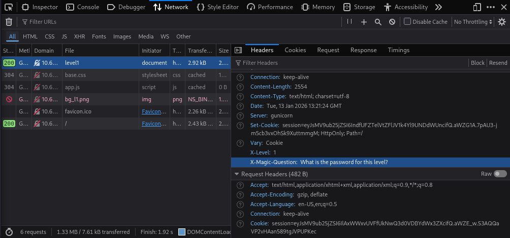

After looking around, in the `level1` we can see a **Header** called *X-Magic-Question*. We have to encode this question to Base64 and paste it in the **Bunnygram**.

It will respond us with another Base64 message, that when uncoded, is the **Password and Answer to the 1st Gate**.

> It might have layered encoding (This is when a phrase is encoded many times.), to get the answer, just add more `From Base64` to the Recipe.

---

## SECOND LOCK - OUTER WALL

When we get to the Second lock, we are faced with the same format as the last wall:

- The **Bunnygram** with a encoded message.
- Login Prompt.

Lets decode **Bunnygram's Message** using **Cyberchef**. Which results in the "All hail King Malhare!" Message as before.

Lets investigate some more, lets try login in.

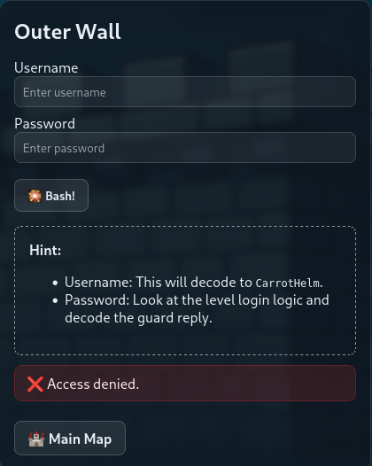

Lets crack down the **Username** first, as we can see its de encoded version of `CarrotHelm`. Lets use Cyberchef to get the Username.

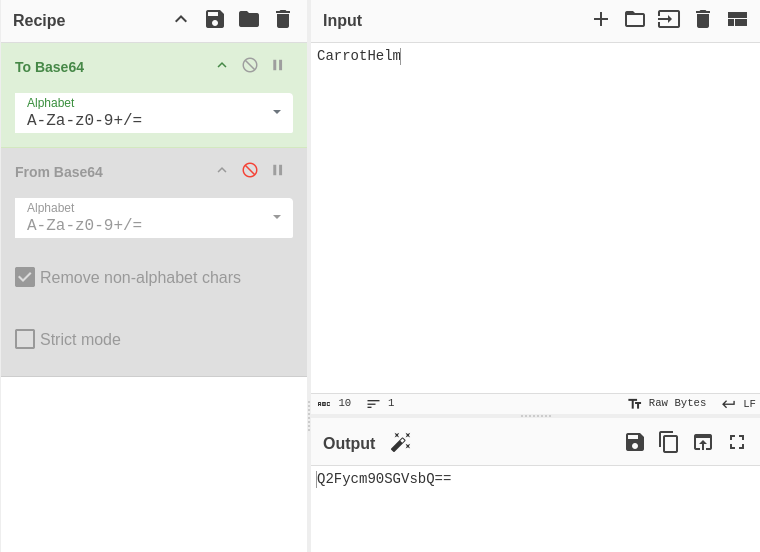

**Secondly**, lets crack down the **Password**.

The hint tells us to look at the **Login Logic**, so lets look at the Network Tab in the Debugger. 

We find a `level2`, where we find yet another **Magic Question**. Lets encode it using Cyberchef and insert it into the **Bunnygram**.

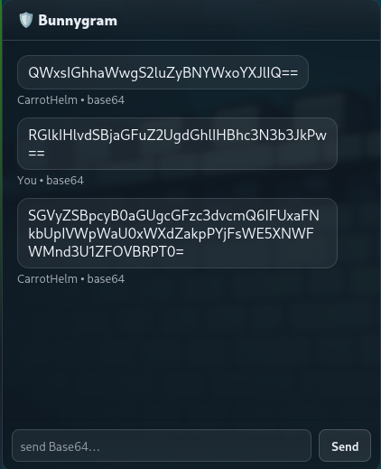

After decoding what **Bunnygram** responded with, we get the password for the **Second Lock and the Answer**.

---

## THIRD LOCK - GUARD HOUSE

In this room its a bit different.

In the **Network Tab** we can see a new Header:

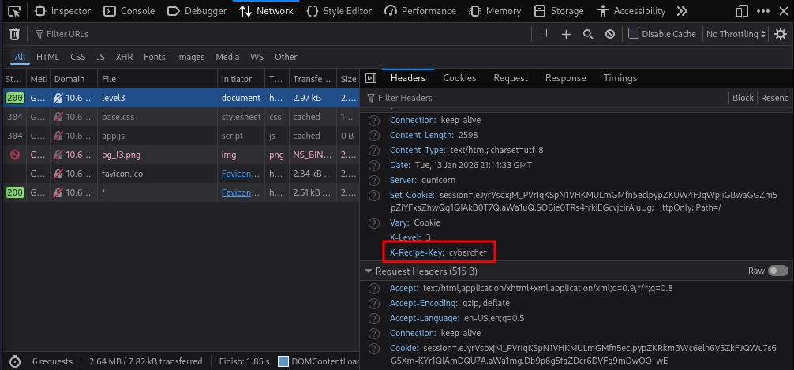

`X-Recipe-Key`. We will get to this a bit later.

First, lets **figure out the USERNAME**. Which as we can see is the decoded version of `LongEars`.

So lets decode it and paste it in the **username prompt and our `encodedusernames.txt`**.

Now, for the **PASSWORD**, lets figure out what we need. Lets check out the login logic.

**Rightclick Page --> Inspect --> Debugger --> app.js** 

Here we can analyze how the login processes the password.

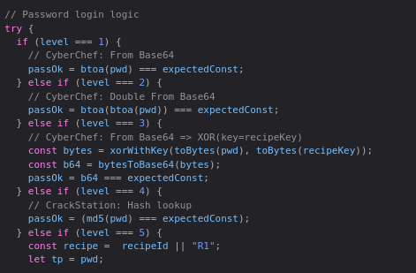

So as we can see, it does the following:

1. It Converts the password to **Base64**
2. It encodes it a 2nd time to **Base64**
3. Then it converts the password to **Bytes** 
4. Encodes the password to XOR (with key).

So now we have a use for the `X-Recipe-Key`.

We just need the password now, lets try asking the **Bunnygram**. Im going to ask `Password please` encoded in **Base64**.

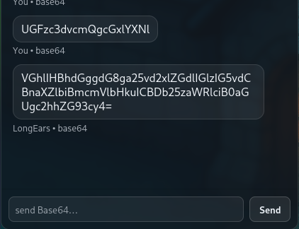

---

### HOW DOES XOR ENCODING WORK??

**XOR (Exclusive OR)** is a reversible operation commonly used for simple encoding and obfuscation.

### What is XOR?
XOR compares two bits and returns:
- `0` if the bits are the same
- `1` if the bits are different

| Bit A | Bit B | A ⊕ B |
|-----|-----|-----|
| 0 | 0 | 0 |
| 0 | 1 | 1 |
| 1 | 0 | 1 |
| 1 | 1 | 0 |

---

### XOR Encoding Process
1. Convert the plaintext into bytes.
2. Choose a key (string or byte sequence).
3. XOR each byte of the plaintext with the corresponding byte of the key.
   - If the key is shorter, it repeats (cyclic XOR).
4. The result is encoded data (often Base64-encoded for readability).


### XOR Decoding Process
XOR decoding uses the **same operation and the same key**:

---

So we just need to encode the Password with the key again to decode it!!!

So in **Cyberchef** we can go to Operations --> Add a `From Base64`

This will decode the **Bunnygram** message, then we get the **ENCODED password**.

Then in **Cyberchef** we add the instruction to reverse the encoding:

1. A `From Base64`
2. A `XOR` with the key `Cyberchef` IN **UTF8**


There we have the decoded password, lets paste it in the Password Prompt and head on to Gate 4.

---

## FORTH LOCK - INNER CASTLE

Firstly lets get the **Username** out of the way, lets encode the word `Lenny` with Cyberchef.

> IMPORTANT: SAVE THE PASSWORD.

Then for the **Password**. If we check the network tab, we have no special headers :(.

Lets check the login logic in the **Debugger Page**, where we find this.

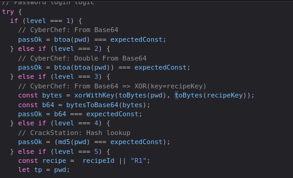

Here we can see the following:

1. Encoded to Base64 (Probably for the Bunnygram)
2. Double encoded to Base64
3. Encoded to XOR with `key=recipeKey` 
4. It says Crackstation to look up what hash it is.

> Im guessing the key is the same as last door.

> **PRO TIP:** Even though it tells us to search up the hash, from the code we can figure out its MD5 by the code (md5() function).

Lets ask for the password by inserting **"Password please"** encoded in Base64 to the **Bunnygram**.

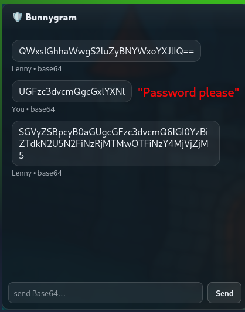

Lets go to Cyberchef and decode it reversing the steps they did:

1. Decode it with `From Base64` --> This will give us the encoded password.

Then we need to decode the **MD5 Hash**.

---

**MD5 (Message Digest Algorithm 5)** is a cryptographic hash function that converts input data into a fixed-length output.

### Key Characteristics
- Produces a **128-bit (32 hex characters)** hash
- Deterministic: same input → same hash
- One-way: **cannot be reversed**
- Fast to compute

### How MD5 Works (High Level)
1. Input data is split into fixed-size blocks.
2. Each block is processed through multiple rounds of mathematical operations.
3. The internal state is continuously mixed.
4. The final result is a **fixed-length hash**, regardless of input size.

### Important Properties
- **Avalanche effect**: small input changes → completely different hash
- **No decryption**: hashes are not encoding or encryption
- **Same input always hashes the same way**

---

Lets go to crackstation, and isnert the hash there.

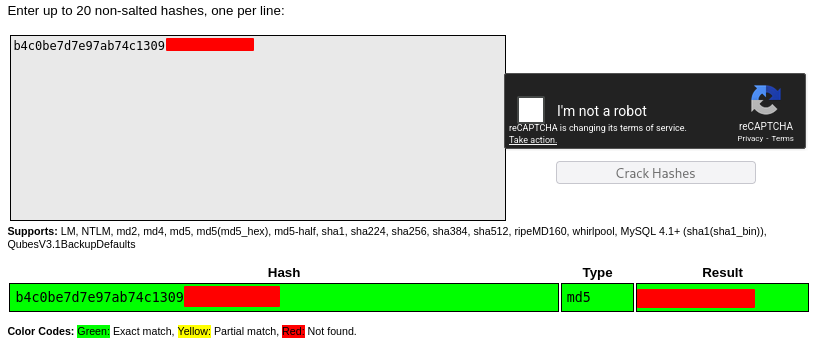

Theres the password!!!

---

## FIFTH LOCK - PRISON TOWER

The Username is the same as always, the encoded version of `carl`. 

Lets get going to the password.

First of all, lets check the **network** and **debugger** tabs for any information:

From **Network** we get the same `X-Recipe-Key` and a new `X-Recipe-ID`.

From **Debugger** we get the following:

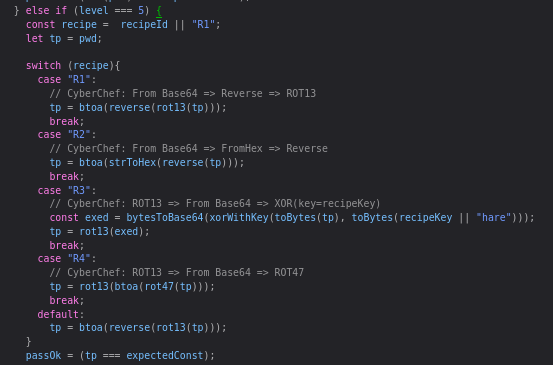

Lets figure this out:

It gives us different cases: `R1`, `R2`, `R3`, etc..

Each one being decoded in one way or another.

**IN OUR CASE** the `X-Recipe-ID` has the value of `R4`. So we know the encoding is the following:

```javascript
case "R4":
            // CyberChef: ROT13 => From Base64 => ROT47
            tp = rot13(btoa(rot47(tp)));
```

Before continuing, lets ask for the password. ("Password please" Encoded in Base64).

Then after getting the phrase from Bunnygram and decoding it (`From Base64`).

We have the following: `MTOQpHAvLmD5pG1sAQkvDj==`

Lets follow the instruction given us by the **login logic** and see what happens.

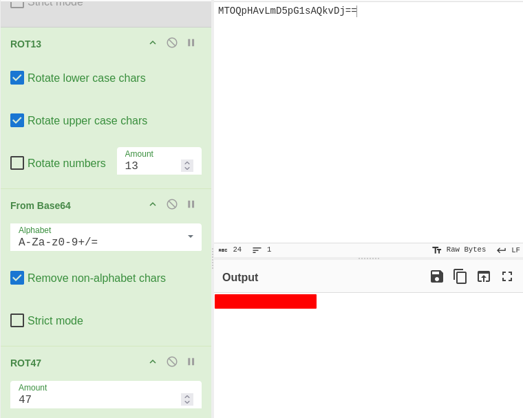

Theres the last password!!.

> Dont close the site yet since it will give you the FLAG!!

---

## SIDEQUEST 3

The Room also gives us a **Cyberchef Link** and tells us that if we can recover the key.

Link: `https://gchq.github.io/CyberChef/#recipe=To_Base64('A-Za-z0-9%2B/%3D')Label('encoder1')ROT13(true,true,false,7)Split('H0','H0%5C%5Cn')Jump('encoder1',8)Fork('%5C%5Cn','%5C%5Cn',false)Zlib_Deflate('Dynamic%20Huffman%20Coding')XOR(%7B'option':'UTF8','string':'h0pp3r'%7D,'Standard',false)To_Base32('A-Z2-7%3D')Merge(true)Generate_Image('Greyscale',1,512)&input=SG9wcGVyIG1hbmFnZWQgdG8gdXNlIEN5YmVyQ2hlZiB0byBzY3JhbWJsZSB0aGUgZWFzdGVyIGVnZyBrZXkgaW1hZ2UuIEhlIHVzZWQgdGhpcyB2ZXJ5IHJlY2lwZSB0byBkbyBpdC4gVGhlIHNjcmFtYmxlZCB2ZXJzaW9uIG9mIHRoZSBlZ2cgY2FuIGJlIGRvd25sb2FkZWQgZnJvbTogCgpodHRwczovL3RyeWhhY2ttZS1pbWFnZXMuczMuYW1hem9uYXdzLmNvbS91c2VyLXVwbG9hZHMvNWVkNTk2MWM2Mjc2ZGY1Njg4OTFjM2VhL3Jvb20tY29udGVudC81ZWQ1OTYxYzYyNzZkZjU2ODg5MWMzZWEtMTc2NTk1NTA3NTkyMC5wbmcKClJldmVyc2UgdGhlIGFsZ29yaXRobSB0byBnZXQgaXQgYmFjayE`

Maybe ill do it another day... :(

---

## FEEDBACK

- I loved this room, i love cryptography and everything related to it, i just dont know how people decode a phrase without any clues like we had.
