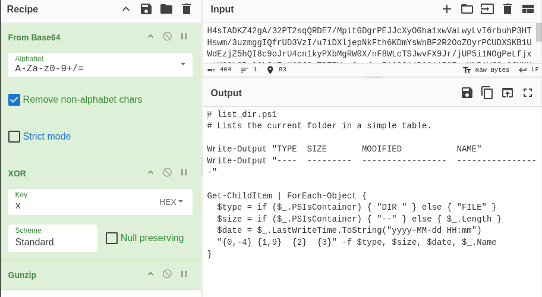
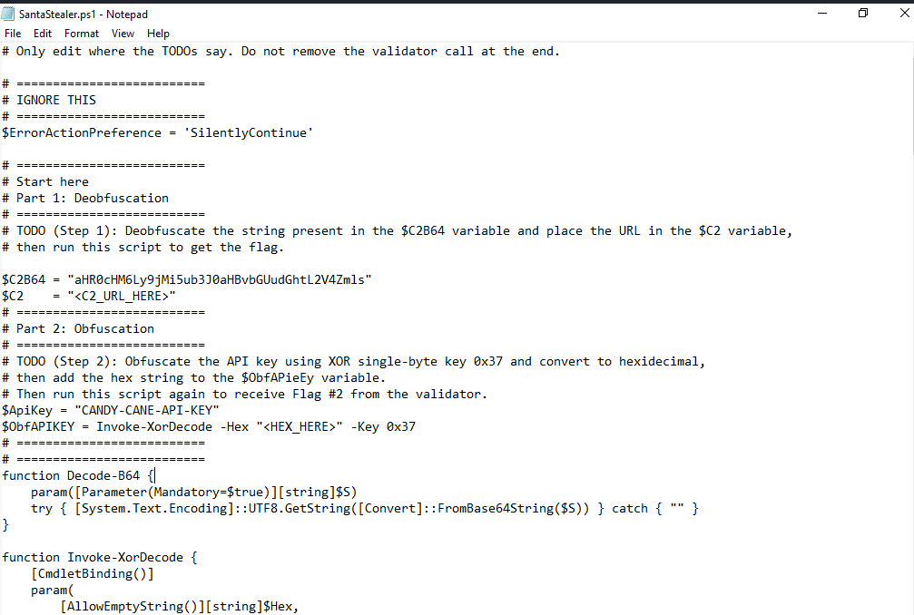
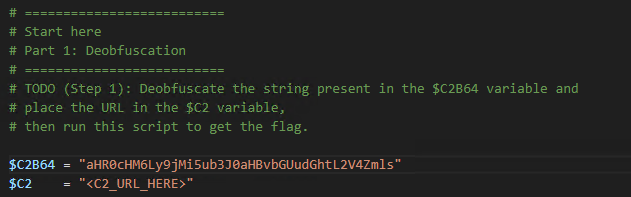
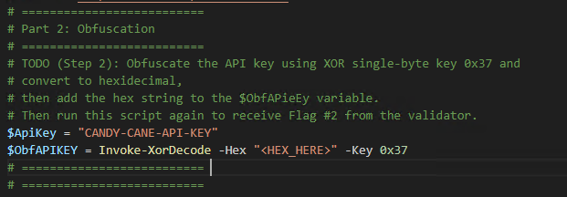
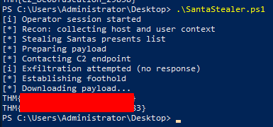

# ROOM 18 - Obfuscation - The Egg Shell File

The context of this room is the following:

WareVille is on edge after a mysterious wormhole triggers system failures and nonstop SOC alerts across TBFC. Amid the chaos, McSkidy investigates a suspicious phishing email pretending to be from “northpole-hr” — a department that doesn’t exist, since TBFC’s HR is based at the South Pole. The email contains strange carrot emojis and leads to the download of a small PowerShell script filled with unreadable, random-looking strings.

Recognizing this as a common sign of **obfuscation**, McSkidy focuses on uncovering its hidden purpose. Obfuscation is often used by attackers to disguise malicious code and evade detection.

This scenario introduces:
- What obfuscation is, why it’s used, and where it’s commonly found  
- The differences between **encoding**, **encryption**, and **obfuscation**  
- Common obfuscation techniques used by attackers  
- How to safely recover hidden plaintext using **CyberChef**

---

Lets start the machine by hitting **"Start Machine"**

We can connect via RDP using the following credentials: **User -** `Administrator` **Password -** `@TryObfusc4t3M393!`

Im going to use RDP.

---

## Understanding the Gibberish

**Obfuscation** is the practice of making data difficult to read or analyze. Attackers use it to evade detection and slow down security investigations. For example, if a security tool blocks files containing a specific keyword, attackers can disguise that word using simple transformations.

One basic method is a **ROT cipher**.  
- **ROT1** shifts each letter forward by one position in the alphabet (a → b, b → c).  
  - Example: *“carrot coins go brr”* becomes *“dbsspu dpjot hp css”*.  
- **ROT13** applies the same idea but shifts letters forward by 13 positions, making it slightly harder to read at a glance.

### Obfuscation in the Real World

Real-world obfuscation is often more complex. A common technique is **XOR obfuscation**, where each character (byte) is combined with a key using the XOR operation. This transforms the data into different bytes, often producing unreadable or unusual characters.

Because techniques like XOR are difficult to reverse manually, analysts rely on tools such as **CyberChef** to safely decode and recover the original plaintext.

### Detecting Patterns

The good thing about well-known obfuscation techniques is that it's easy to reverse it once you figure out the technique used.

You can use these quick visual clues to guess the obfuscation technique used:

- ROT1 - common words look “one letter off”, spaces stay the same. Easy enough to detect.
- ROT13 - Look for three-letter words. Common ones like  the become gur. And and becomes naq. spaces stay the same.
- Base64 - Long strings containing mostly alphanumeric characters (i.e., A-Z, a-z, 0–9), sometimes with + or /, often ending in = or ==.
- XOR - A bit more tricky. Looks like random symbols but stays the same length as the original. If a short secret was reused, you may notice a tiny repeat every few characters.

### Unfamiliar Patterns

Not sure what you’re looking at? It's fine. Even if you don't have an idea of what cipher was used, it is easy enough to keep on trying different operations just to see if the text becomes readable.

CyberChef also includes an operation called Magic that automatically guesses and tries common decoders for you. To use it, just add the Magic operation and look at the results. It will display multiple results and it's up to you to check which one ends up making sense. You can even check "Intensive mode" to make sure it tests more possibilities before giving up.

> Note: This wont catch everything

### Unfamiliar Patterns

Not sure what you’re looking at? It's fine. Even if you don't have an idea of what cipher was used, it is easy enough to keep on trying different operations just to see if the text becomes readable.

CyberChef also includes an operation called Magic that automatically guesses and tries common decoders for you. To use it, just add the Magic operation and look at the results. It will display multiple results and it's up to you to check which one ends up making sense. You can even check "Intensive mode" to make sure it tests more possibilities before giving up.

---

# CHALLANGE

So now the room tells us that a **Powershell script** was extracted from the pdf, and that we have to unobfuscate it.

The file is located in the Desktop and its called `SantaStealer.ps1`.

After opening it with **Notepad** we have the following:

>Note: To open with notepad: Right click the file --> Open With --> Notepad.

Okay, lets also open **Cyberchef** in our browser, and look at **Part 1**:

Lets get started, first we copy the `$C2B64` and paste in *Cyberchef*.

As we can see in the little wand simbol also known as "Magic", it says that using `From Base64` it will give a output of `http:/etc..` (The answer).

Perfect, so it was only encoded with **Base64**. 

> **NOTE:** We could have deducted this via the **variable name** that is the following $ C-2 (to)-B64 . (This is just some logic i saw, i dont know if it has real coleration).

Perfect, lets replace the `$C2` variable with the **output** given to us by Cyberchef.

---

Perfect! In **part 2**, we have the following:

It tells us to do the following:

1. Obfuscate the API key (`$ApiKey`) using **XOR single byte key 0x37**
2. Convert the output to **Hexidecimal**
3. Add the hexadecimal output to the `$ObfAPieEy`

Lets get to it!!

Okay first let get the `$ApiKey` value and paste it to **Cyberchef**.

Then, first we have to insert a **XOR** in th recipe with the key being `37`, `standard` scheme.

> NOTE: Either search up "XOR" or in the "Encrypytion / Encoding" section.

Secondly, add a `To Hex`, to finish. 

Then we copy the output and paste it in the `<HEX_HERE>`.

The final file should be like:

---

## Running the Program

Finished!!

To get the flags to finish the room we need to save the file and then open up **Powershell**.

> How to Open Powershell: Windows Search Bar --> Search "Powershell"

In **Powershell**, we direct ourselves where the script is saved (Desktop): `cd Desktop`

and we run the file with: `.\SantaStealer.ps1`

---

## FEEDBACK

- Another room i really liked, i love encryption and these topics in general.

- Honeslty, i thought it was really short.
