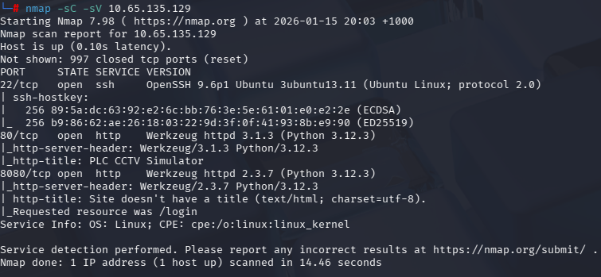
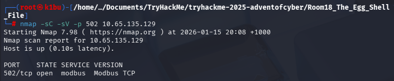
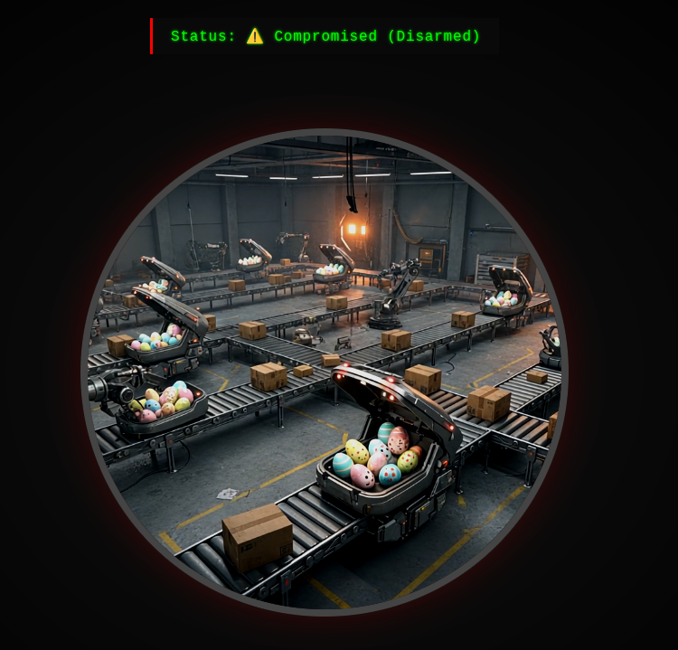

# ROOM 19 - ICS/Modbus - Claus for Concern

## Overview
On the busiest shipping day of the season, TBFC’s drone delivery system malfunctions across Wareville. Customers expecting Christmas gifts instead receive chocolate eggs. Despite normal system metrics, inventory and delivery data are being falsified. Evidence points to a deliberate cyberattack led by **King Malhare** and the **Eggsploit** group.

## The Problem
- Delivery drones report **98% success**, but deliver the **wrong items**
- Sensor data and manifests show correct deliveries, masking the issue
- All incorrect items share **identical weight and dimensions** with expected gifts
- Attack traces are actively erased

## Key Evidence
A fleeting system message appears:
> 🐰 **EGGSPLOIT v6.66 – Property of HopSec Island**  
> “Why should Christmas have all the fun?” – King Malhare

## Critical Discovery
A handwritten **PLC/Modbus register map** is found near the control terminal, revealing:
- **Holding Registers**
  - `HR0`: Package type (Christmas / Eggs / Easter)
  - `HR1`: Delivery zone (Zone 10 = ocean dump)
  - `HR4`: System signature/version
- **Control Coils**
  - `C10`: Inventory verification
  - `C11`: Protection/override lock (**dangerous if active**)
  - `C12`: Emergency dump (destroys inventory)
  - `C13`: Audit logging
  - `C14`: Christmas restored flag
  - `C15`: Self-destruct status

⚠️ **Warning:** Changing `HR0` while `C11` is enabled triggers a countdown trap.

## Mission Objective
- Investigate the compromised **Drone Delivery SCADA/PLC system**
- Identify how Eggsploit manipulated inventory and sensor data
- Disable traps and restore safe Christmas deliveries
- Avoid triggering fail-safes or self-destruct mechanisms

## Learning Objectives
- Understand **SCADA** and **PLC** roles in industrial automation
- Learn how **Modbus** enables device communication
- Identify malicious configuration changes in ICS environments
- Safely remediate compromised control systems
- Recognize protection mechanisms and trap logic in ICS attacks

---

Lets start the **Target Machine**.

---

# What Is SCADA?

**SCADA (Supervisory Control and Data Acquisition)** systems are the command centres of industrial operations. They connect human operators to machines, collecting real-time data from the physical world and issuing commands that control automated processes. Think of SCADA as the **nervous system of a factory**—it senses, decides, and acts.

At TBFC, SCADA oversees the entire drone delivery operation. It allows operators to monitor hundreds of drones, manage inventory, and ensure packages reach the correct destinations. Without SCADA, Christmas logistics would grind to a halt.

---

## Core Components of a SCADA System

A typical SCADA system is made up of four key elements:

### 1. Sensors & Actuators
- **Sensors** measure real-world conditions such as weight, position, temperature, or pressure.
- **Actuators** perform physical actions like moving robotic arms or activating conveyor belts.
- At TBFC, sensors detect packages on belts, while actuators load them onto drones.

### 2. PLCs (Programmable Logic Controllers)
- PLCs execute automation logic.
- They read sensor data, apply programmed rules, and control actuators.
- Example: *If package weight matches a chocolate egg and destination is Zone 5, load Drone 7.*

### 3. Monitoring Systems
- Interfaces such as dashboards, alarms, and CCTV feeds.
- Provide operators with real-time visibility into physical operations.
- TBFC’s CCTV cameras allow staff to visually verify what the automation is doing.

### 4. Historians
- Databases that store operational and configuration data.
- Used for troubleshooting, trend analysis, and incident investigation.
- Attackers often disable historians to hide their actions.

---

## SCADA’s Role in TBFC’s Drone System

The compromised SCADA system controls several critical functions:

- **Package type selection**  
  Determines whether drones carry Christmas gifts, chocolate eggs, or Easter baskets.
- **Delivery zone routing**  
  Zones 1–9 are valid destinations; Zone 10 is an ocean dump failsafe.
- **Visual monitoring**  
  Real-time CCTV feeds allow operators to confirm system behaviour.
- **Inventory verification**  
  Ensures requested items actually exist before loading.
- **System protection mechanisms**  
  Locks and monitors configuration changes—now weaponised as traps.
- **Audit logging**  
  Records all system activity; disabled by attackers to erase evidence.

---

## Why SCADA Systems Are Prime Targets

Industrial control systems are attractive to attackers because:

- They often run **legacy software** with known vulnerabilities.
- **Default credentials** are frequently left unchanged.
- They were designed for **reliability, not security**.
- They control **physical processes**, creating real-world impact.
- They are commonly connected to **corporate IT networks**.
- Protocols like **Modbus lack authentication**, allowing unauthorised control.

In early 2024, the first ICS-specific malware, **FrostyGoop**, demonstrated direct manipulation of PLCs via **Modbus TCP (port 502)**.

King Malhare uses the same technique—not to cause blackouts, but to sabotage Christmas by directly altering control values in TBFC’s SCADA system.

---

# What Is SCADA?

**SCADA (Supervisory Control and Data Acquisition)** systems are the command centres of industrial operations. They connect human operators to machines, collecting real-time data from the physical world and issuing commands that control automated processes. Think of SCADA as the **nervous system of a factory**—it senses, decides, and acts.

At TBFC, SCADA oversees the entire drone delivery operation. It allows operators to monitor hundreds of drones, manage inventory, and ensure packages reach the correct destinations. Without SCADA, Christmas logistics would grind to a halt.

---

## Core Components of a SCADA System

A typical SCADA system is made up of four key elements:

### 1. Sensors & Actuators
- **Sensors** measure real-world conditions such as weight, position, temperature, or pressure.
- **Actuators** perform physical actions like moving robotic arms or activating conveyor belts.
- At TBFC, sensors detect packages on belts, while actuators load them onto drones.

### 2. PLCs (Programmable Logic Controllers)
- PLCs execute automation logic.
- They read sensor data, apply programmed rules, and control actuators.
- Example: *If package weight matches a chocolate egg and destination is Zone 5, load Drone 7.*

### 3. Monitoring Systems
- Interfaces such as dashboards, alarms, and CCTV feeds.
- Provide operators with real-time visibility into physical operations.
- TBFC’s CCTV cameras allow staff to visually verify what the automation is doing.

### 4. Historians
- Databases that store operational and configuration data.
- Used for troubleshooting, trend analysis, and incident investigation.
- Attackers often disable historians to hide their actions.

---

## SCADA’s Role in TBFC’s Drone System

The compromised SCADA system controls several critical functions:

- **Package type selection**  
  Determines whether drones carry Christmas gifts, chocolate eggs, or Easter baskets.
- **Delivery zone routing**  
  Zones 1–9 are valid destinations; Zone 10 is an ocean dump failsafe.
- **Visual monitoring**  
  Real-time CCTV feeds allow operators to confirm system behaviour.
- **Inventory verification**  
  Ensures requested items actually exist before loading.
- **System protection mechanisms**  
  Locks and monitors configuration changes—now weaponised as traps.
- **Audit logging**  
  Records all system activity; disabled by attackers to erase evidence.

---

## Why SCADA Systems Are Prime Targets

Industrial control systems are attractive to attackers because:

- They often run **legacy software** with known vulnerabilities.
- **Default credentials** are frequently left unchanged.
- They were designed for **reliability, not security**.
- They control **physical processes**, creating real-world impact.
- They are commonly connected to **corporate IT networks**.
- Protocols like **Modbus lack authentication**, allowing unauthorised control.

In early 2024, the first ICS-specific malware, **FrostyGoop**, demonstrated direct manipulation of PLCs via **Modbus TCP (port 502)**.

King Malhare uses the same technique—not to cause blackouts, but to sabotage Christmas by directly altering control values in TBFC’s SCADA system.

---

# What Is SCADA?

**SCADA (Supervisory Control and Data Acquisition)** systems are the command centres of industrial operations. They connect human operators to machines, collecting real-time data from the physical world and issuing commands that control automated processes. Think of SCADA as the **nervous system of a factory**—it senses, decides, and acts.

At TBFC, SCADA oversees the entire drone delivery operation. It allows operators to monitor hundreds of drones, manage inventory, and ensure packages reach the correct destinations. Without SCADA, Christmas logistics would grind to a halt.

---

## Core Components of a SCADA System

A typical SCADA system is made up of four key elements:

### 1. Sensors & Actuators
- **Sensors** measure real-world conditions such as weight, position, temperature, or pressure.
- **Actuators** perform physical actions like moving robotic arms or activating conveyor belts.
- At TBFC, sensors detect packages on belts, while actuators load them onto drones.

### 2. PLCs (Programmable Logic Controllers)
- PLCs execute automation logic.
- They read sensor data, apply programmed rules, and control actuators.
- Example: *If package weight matches a chocolate egg and destination is Zone 5, load Drone 7.*

### 3. Monitoring Systems
- Interfaces such as dashboards, alarms, and CCTV feeds.
- Provide operators with real-time visibility into physical operations.
- TBFC’s CCTV cameras allow staff to visually verify what the automation is doing.

### 4. Historians
- Databases that store operational and configuration data.
- Used for troubleshooting, trend analysis, and incident investigation.
- Attackers often disable historians to hide their actions.

---

## SCADA’s Role in TBFC’s Drone System

The compromised SCADA system controls several critical functions:

- **Package type selection**  
  Determines whether drones carry Christmas gifts, chocolate eggs, or Easter baskets.
- **Delivery zone routing**  
  Zones 1–9 are valid destinations; Zone 10 is an ocean dump failsafe.
- **Visual monitoring**  
  Real-time CCTV feeds allow operators to confirm system behaviour.
- **Inventory verification**  
  Ensures requested items actually exist before loading.
- **System protection mechanisms**  
  Locks and monitors configuration changes—now weaponised as traps.
- **Audit logging**  
  Records all system activity; disabled by attackers to erase evidence.

---

## Why SCADA Systems Are Prime Targets

Industrial control systems are attractive to attackers because:

- They often run **legacy software** with known vulnerabilities.
- **Default credentials** are frequently left unchanged.
- They were designed for **reliability, not security**.
- They control **physical processes**, creating real-world impact.
- They are commonly connected to **corporate IT networks**.
- Protocols like **Modbus lack authentication**, allowing unauthorised control.

In early 2024, the first ICS-specific malware, **FrostyGoop**, demonstrated direct manipulation of PLCs via **Modbus TCP (port 502)**.

King Malhare uses the same technique—not to cause blackouts, but to sabotage Christmas by directly altering control values in TBFC’s SCADA system.

---

## What Is SCADA?

**SCADA (Supervisory Control and Data Acquisition)** systems are the command centres of industrial operations. They connect human operators to machines, collecting real-time data from the physical world and issuing commands that control automated processes. Think of SCADA as the **nervous system of a factory**—it senses, decides, and acts.

At TBFC, SCADA oversees the entire drone delivery operation. It allows operators to monitor hundreds of drones, manage inventory, and ensure packages reach the correct destinations. Without SCADA, Christmas logistics would grind to a halt.

---

## Core Components of a SCADA System

A typical SCADA system is made up of four key elements:

### 1. Sensors & Actuators
- **Sensors** measure real-world conditions such as weight, position, temperature, or pressure.
- **Actuators** perform physical actions like moving robotic arms or activating conveyor belts.
- At TBFC, sensors detect packages on belts, while actuators load them onto drones.

### 2. PLCs (Programmable Logic Controllers)
- PLCs execute automation logic.
- They read sensor data, apply programmed rules, and control actuators.
- Example: *If package weight matches a chocolate egg and destination is Zone 5, load Drone 7.*

### 3. Monitoring Systems
- Interfaces such as dashboards, alarms, and CCTV feeds.
- Provide operators with real-time visibility into physical operations.
- TBFC’s CCTV cameras allow staff to visually verify what the automation is doing.

### 4. Historians
- Databases that store operational and configuration data.
- Used for troubleshooting, trend analysis, and incident investigation.
- Attackers often disable historians to hide their actions.

---

## SCADA’s Role in TBFC’s Drone System

The compromised SCADA system controls several critical functions:

- **Package type selection**  
  Determines whether drones carry Christmas gifts, chocolate eggs, or Easter baskets.
- **Delivery zone routing**  
  Zones 1–9 are valid destinations; Zone 10 is an ocean dump failsafe.
- **Visual monitoring**  
  Real-time CCTV feeds allow operators to confirm system behaviour.
- **Inventory verification**  
  Ensures requested items actually exist before loading.
- **System protection mechanisms**  
  Locks and monitors configuration changes—now weaponised as traps.
- **Audit logging**  
  Records all system activity; disabled by attackers to erase evidence.

---

## Why SCADA Systems Are Prime Targets

Industrial control systems are attractive to attackers because:

- They often run **legacy software** with known vulnerabilities.
- **Default credentials** are frequently left unchanged.
- They were designed for **reliability, not security**.
- They control **physical processes**, creating real-world impact.
- They are commonly connected to **corporate IT networks**.
- Protocols like **Modbus lack authentication**, allowing unauthorised control.

In early 2024, the first ICS-specific malware, **FrostyGoop**, demonstrated direct manipulation of PLCs via **Modbus TCP (port 502)**.

King Malhare uses the same technique—not to cause blackouts, but to sabotage Christmas by directly altering control values in TBFC’s SCADA system.

---

> **IMPORTANT:** **TCP Port 502** is the port most commonly used by Modbus TCP.

---

## What Is a PLC?

A **PLC (Programmable Logic Controller)** is a rugged industrial computer used to control machinery and automated processes. Unlike general-purpose computers, PLCs are purpose-built for **reliability, real-time control, and direct interaction with physical hardware**.

## What PLCs Are Designed For

PLCs are engineered to:

- **Survive harsh environments**  
  They operate reliably in extreme temperatures, vibration, dust, moisture, and electrical interference. In a warehouse, a PLC may run in freezing storage areas or near hot, noisy machinery.

- **Run continuously without failure**  
  PLCs are expected to operate **24/7 for years or decades** without rebooting. Downtime in industrial environments is costly and often unacceptable.

- **Execute logic in real time**  
  PLCs respond to sensor inputs within milliseconds. When a package reaches the end of a conveyor belt, the PLC must instantly trigger a robotic arm—timing is critical for safety and efficiency.

- **Interface directly with physical hardware**  
  PLCs connect directly to sensors (weight, position, temperature) and actuators (motors, valves, robotic arms), speaking the electrical language of machines.

---

# What Is Modbus?

**Modbus** is the communication protocol industrial devices use to talk to each other. Created in 1979, it remains one of the most widely used industrial protocols due to its **simplicity and reliability**.

Modbus follows a basic request–response model:

- **Client:** “PLC, what’s the value of register 0?”
- **Server (PLC):** “Register 0 = 1”

This simplicity made Modbus easy to adopt—but security was never part of the design.

---

## Modbus Data Types

Modbus organizes data into four types:

| Type              | Purpose                     | Values     | Example Uses                     |
|-------------------|-----------------------------|------------|----------------------------------|
| **Coils**         | Digital outputs (writeable) | 0 or 1     | Motor on/off, alarm active       |
| **Discrete Inputs** | Digital inputs (read-only) | 0 or 1     | Button pressed, sensor triggered |
| **Holding Registers** | Analogue outputs (writeable) | 0–65535 | Zone selection, setpoints        |
| **Input Registers** | Analogue inputs (read-only) | 0–65535 | Temperature, pressure readings  |

**Key distinction:**  
- *Coils* and *Holding Registers* can be **written to** (control the system)  
- *Discrete Inputs* and *Input Registers* are **read-only** (observe the system)

---

## Modbus in the TBFC Drone System

### Holding Registers
- `HR0`: Package type  
  - `0` = Christmas gifts  
  - `1` = Chocolate eggs  
  - `2` = Easter baskets
- `HR1`: Delivery zone (1–9 normal, 10 = ocean dump)
- `HR4`: System signature/version

### Coils
- `C10`: Inventory verification
- `C11`: Protection mechanism
- `C12`: Emergency dump protocol
- `C13`: Audit logging
- `C14`: Christmas restored flag
- `C15`: Self-destruct status

The handwritten maintenance note documented these exact addresses.

---

## Modbus Addressing

Every Modbus value has a unique address, similar to a house number.

⚠️ **Critical detail:** Modbus addresses are **zero-indexed**.

Examples:
- Holding Register `0` → `HR0` (package type)
- Holding Register `1` → `HR1` (delivery zone)
- Coil `10` → `C10` (inventory verification)
- Coil `15` → `C15` (self-destruct status)

---

## Modbus TCP vs Serial Modbus

- **Serial Modbus (RS-232/RS-485)**  
  Required physical access to wiring, offering implicit security through isolation.

- **Modbus TCP**  
  Runs over standard TCP/IP networks, listening on **port 502** by default.

While Modbus TCP enables remote management and integration, it also exposes industrial systems to network-based attacks.

---

## The Security Problem with Modbus

Modbus has **no built-in security**:

- ❌ No authentication
- ❌ No encryption
- ❌ No authorisation
- ❌ No cryptographic integrity checks

Anyone who can reach port 502 can read or write any value.

---

## Connecting the Dots

King Malhare didn’t need the web interface. He connected **directly to the Modbus TCP port** and manipulated the registers and coils controlling the system.

The maintenance note’s warning—  
> *“Never change HR0 while C11=True!”*  

—reveals the existence of a trap mechanism discovered too late.

Next, the investigation shifts to interacting with the system the same way the attacker did: **direct Modbus reads and writes using Python**.

---

# PRACTICAL

Now that we know the basic concepts, lets analyze the compromised TBFC Drone Control System and how to restore it.

## INITIAL RECONNAISANCE

Lets get to it, first we need to discover what services are running on the machine, so lets grab the IP and run a **nmap scan**.

So in out terminals, lets run the following:

`nmap -sV -sC MACHINE_IP`

As we can we can see theres various ports open:

- Port 22 (TCP) - SSH.
- Port 80 (TCP) - http --> CCTV Simulator.
- Port 8080 (TCP) - http
- Port 502 (TCP) - ModBus
> NOTE: Sometimes nmap will fail and not scan 502.

Lets head to the http service on **port 80** to check whats happening.

`http://MACHINE_IP:80`

With this we can figure out the following:

- **The system is operating correctly, but with manipulated logic**  
  All machinery is functioning normally; the attack altered control values, not hardware, indicating a logic manipulation attack rather than system failure.

- **SCADA metrics alone are unreliable during an ICS attack**  
  Dashboards report normal operations, but the CCTV feed reveals the real physical outcome, proving that telemetry can be falsified.

- **Physical observation is essential for safe remediation**  
  The live camera feed confirms the attack’s real-world impact and provides immediate feedback when corrective changes are made.

---

## Modbus Reconnaisance

Now we need to actually write the scripts to ask the server directly.

If your using your own machine, we are going to need to install the  **pymodbus** library.

`pip3 install pymodbus==3.6.8`

Then we are going to run the `reconnaisance.py` script in my github.

> To learn how it works tryhackme goes step by step.

`python3 reconaissance.py`

After running it, we can see that we need to:

1. Disable C11 (Protection mechanism) FIRST
2. Change package type **HRO = 0** to Christmas gifts.
3. Enable Inventory verification (**C10 = True**)
4. Enable Logging **C13 = True**
5. Verify C15 never got armed.

so lets do that. 

We can see the completed code in `restore.py`

---

Thats it!!!

---

## FEEDBACK

- I didnt like this one, i wasnt really motivated, its a interesting topic but i wasnt motivated.

