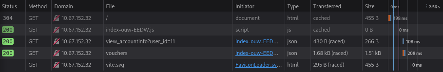
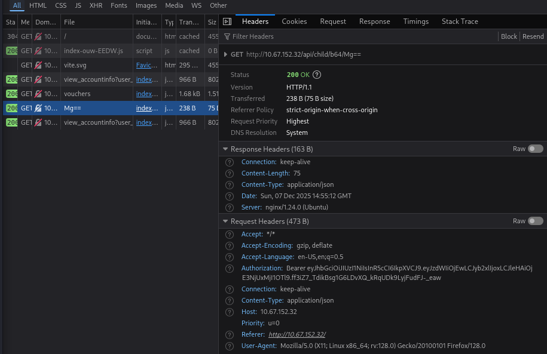

# ROOM 5 - IDOR - Santas Little IDOR (httpbnry)

The elves of Wareville are investigating security issues on the **TryPresentMe** website after McSkidy went missing. The support team has reported problems with voucher activation and an increase in targeted phishing emails containing non-public information.

An investigation uncovered a suspicious account, **Sir Carrotbane**, which held a large number of vouchers. The account was deleted and the vouchers were recovered, but signs of a deeper security problem remain.

Help the TBFC staff investigate the TryPresentMe website and identify and fix its vulnerabilities.

### Learning Objectives
- Understand authentication and authorization concepts.
- **Identify Insecure Direct Object Reference (IDOR) vulnerabilities**.
- Exploit IDOR for *horizontal privilege escalation*.
- Learn how to **mitigate IDOR** by implementing Secure Direct Object References (SDOR).

Lets start themachine and connect to the **TryPresentMe application** at `http://MACHINE_IP`

---

## WHAT IS IDOR?

Insecure Direct Object Reference (IDOR) is a vulnerability that occurs when a web application exposes internal object identifiers (such as `packageID`) and fails to verify whether the user is authorized to access the requested data. By simply changing values in a URL, attackers may gain access to other users’ sensitive information.

This vulnerability exists because applications often trust user input directly in database queries without enforcing access control. When identifiers follow predictable patterns (like sequential numbers), they become easy to guess and exploit.

Understanding IDOR requires knowing the difference between:

- **Authentication** – Verifying who the user is (e.g., login process)
- **Authorization** – Verifying what the user is allowed to access

Authorization can only happen after authentication. If a system does not know who a user is, it cannot restrict their access properly.

IDOR is a form of **horizontal privilege escalation**, where a user accesses data belonging to another user using features they are normally allowed to use. Preventing IDOR requires strict authorization checks on every request to ensure users can only access their own information.

---

## ITERATE DIGITS, OBSERVE RESPONSES

As we can see in the web page given to us, its a login page to the **TryPresentMe Application**. 

TryHackMe presents us with a set of **login credentials**:

**User:** `niels`
**Password:** `TryHackMe#2025`

So we login with those credentials. 

When we login we can see a dashboard with the *account information*, a *dashboard where you can manage gifts for your children*, and a *voucher tracker*.

Lets go into the **Developer Tools** to understand whats happening in the background.

So we hit `Q` and go to the **Network** tab.

> We hit Q in Firefox, but you can also rightclick and click "Developer Tools"

Firstly it wont show up anything, but when we **reload the page**, we can start seeing what is going on.

We can now see 5 files, and one says `view_accountinfo?user..` lets click on that one.

A section opens up that shows the `GET` request, that as we can see, is a potential case for IDOR.

`http://MACHINE_IP/api/parents/view_accountinfo?user_id=10`

Now let go and expand the **Response** tab, where we can see the `user_id` that corresponds to our user.

This tab tells us that our `user_id` is the webpages referense for getting details, lets see what happens when we change this.

Lets head to the **Storage** tab, where we can see in **Local Storage** that this is where the page stores the `auth_user`.

When we change the `user_id` to `11` and reload the page, when can see that the page now thinks we are `user_id=11`

This is the simplest form of IDOR, by simply changing the `user_id` to something else means we can see some other user's data.

Lets change it back to continue with the rest of the challanges.

So we head to **Local Storage** and change the `user_id=10`. 

> **IMPORTANT**: WE USE THIS EXPLOIT TO ANSWER QUESTION NUMBER 3, BY CHANGING THE `user_id` AND GOING UPWARDS
---

## IN DISGUISE: OBVIOUS REFERENCES

Sometimes, IDOR may not be as simple as just a number, sometimes, encoding might be used. 

On the **Child Section**, click on the **eye icon** next to the *first child*.

Then, on the **Network Tab** in **Developer Tools** lets check what requests are being made.

The **GET REQUEST** is:

`GET http://MACHINE_IP/api/child/b64/Mg==`

As we can see the `Mg==` is the *base64* encoded version of the number 2.

This means we can still perform IDOR with this request, by just encoding the number first. 

---

Sometimes the values may look like hash (*such as MD5 or SHA1*), and we could perform an IDOR if we figure out
what value was used to generate the hash.

---

## ITS DETERMINISTIC, OBVIOUSLY REPRODUCIBLE

Sometimes you have to dig quite deep for IDOR, lets look at the vouchers, we need to investigate what algorithm was used to generate them. Their format looks like a UUID, so lets use the [UUID Decoder](https://www.uuidtools.com/decode) to decode the UUID.

By introducing one of the voucher UUIDs in the *UUID Decoder*, we can see that it was made with the **UUID version 1**, making it reproducable.

---

## SUMMARY / FEEDBACK

- I though this was a very interesting room, i liked it very much, its a very interesting topic.
