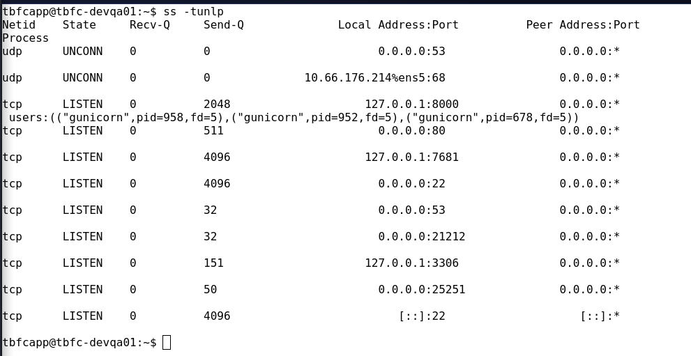

# ROOM 6 - Network Discovery - Scan-ta Clause

The context of the room is the following:

The QA environment has been breached by *HopSec*, locking access to `tbfc-devqa01` and halting the entire **SOC-mas pipeline**. The compromised server is mutating into a malicious “EAST-mas node,” and urgent action is required to restore it before takeover is complete.

Three bad bunnies are hiding on the server, each guarding a secret Easter egg. To recover the system, you must investigate the host, uncover HopSec’s access paths, and exploit exposed services and ports to regain control.

## Learning Objectives

- Use **Nmap** for network service discovery 
- Understand core **network protocols and concepts** 
- Discover hidden services and vulnerabilities 
- Regain access

---

## DISCOVERING EXPOSED SERVICES

So we know the **IP address**, so we are going to scan de IP in search of **OPEN PORTS**.

The room also tells us that we are going to need to find **3 KEYS** with the format `KEYNAME:KEY`.

so lets scan the IP with **nmap**.

> Nmap is an open-source network scanning tool used to discover hosts, open ports, services, and vulnerabilities on a network.

Im going to use the command: 

`nmap -sV -sC MACHINE_IP`

This will also run 2 nmap scripts that detect service version and the other one runs other basic scripts.

These are the results

```
Starting Nmap 7.95 ( https://nmap.org ) at 2025-12-11 07:16 AEST
Stats: 0:00:01 elapsed; 0 hosts completed (1 up), 1 undergoing SYN Stealth Scan
SYN Stealth Scan Timing: About 0.80% done
Nmap scan report for 10.66.176.214
Host is up (0.10s latency).
Not shown: 998 filtered tcp ports (no-response)
PORT   STATE SERVICE    VERSION
22/tcp open  tcpwrapped
|_ssh-hostkey: ERROR: Script execution failed (use -d to debug)
80/tcp open  http       nginx
|_http-title: TBFC QA \xE2\x80\x94 EAST-mas

Service detection performed. Please report any incorrect results at https://nmap.org/submit/ .
Nmap done: 1 IP address (1 host up) scanned in 21.41 seconds
```

As we can see, theres 2 open ports.

- 22 - SSH
- 80 - HTTP nginx (web page)

Lets go to the webpage, but first, lets scan all of the ports, using `-p-` as a parameter.

`nmap -sV -sC -oN -p- nmapscan 10.66.176.214`

> In the website you'll find the **1st Answer**

The results of the nmap scan return **another open port**, a **FTP** service in port 21212

```
21212/tcp open  ftp        vsftpd 3.0.5                                                             
| ftp-syst:                                                                                         
|   STAT:                                                                                           
| FTP server status:                                                                                
|      Connected to 192.168.173.142                                                                 
|      Logged in as ftp                                                                             
|      TYPE: ASCII                                                                                  
|      No session bandwidth limit                                                                   
|      Session timeout in seconds is 300                                                            
|      Control connection is plain text                                                             
|      Data connections will be plain text                                                          
|      At session startup, client count was 1                                                       
|      vsFTPd 3.0.5 - secure, fast, stable                                                          
|_End of status                                                                                     
| ftp-anon: Anonymous FTP login allowed (FTP code 230)                                              
|_Can't get directory listing: TIMEOUT 
```
As we can see, it says **anonymous FTP login allowed**, so lets do that.

So with the command:

`ftp MACHINE_IP PORT_NUM`

we connect to the machine.

then, we do `ls` and we see a file called `tbfc_qa_key1`, which we can download to our computer with `get tbfc_qa_key1`.

Then we cat it out with `cat tbfc_qa_key1` and we get the **2nd answer**.

---

## PORT 25251

In the nmap scan, we can also see a last open port, **port 25251**, which is a app. We dont know what service is, so were going to use **netcat**, a tool that lets us interact with many network services.

`nc MACHINE_IP PORT_NUM`

Then we connect to a app, we type `HELP` and then we see a command `GET KEY`

Which gives us a key for the **3rd Question**.

---

## TCP AND UDP PORTS

We have scanned all of the TCP ports, but theres also 65535 **UDP Ports**, lets scan those by specifying the `-sU`.

`nmap -sU MACHINE_IP`

The results tell us that there is a open **Port 53**.

```
Starting Nmap 7.95 ( https://nmap.org ) at 2025-12-11 08:27 AEST
Nmap scan report for 10.66.176.214
Host is up (0.099s latency).
Not shown: 999 open|filtered udp ports (no-response)
PORT   STATE SERVICE
53/udp open  domain

Nmap done: 1 IP address (1 host up) scanned in 33.70 seconds
```
The UDP Port 53 is associated with a DNS-a protocol that drives modern web by connecting to IPs.

Lets use the `dig` command if it knows the key.

> dig is a command-line tool used to query DNS servers and retrieve domain name and IP address information.

`dig @MACHINE_IP TXT key3.tbfc.local +short`

Command explanation:
- `dig` → DNS query tool
- `@MACHINE_IP` → DNS server to query
- `TXT` → record type being requested
- `key3.tbfc.local` → domain name being queried
- `+short` → only show the answer, not extra details

---

## ON-HOST Service Discovery

Now that we have the 3 keys, when we go to the website, we can combine the 3 keys **KEY1-KEY2-KEY3**.

With this we can unblock the terminal and get access to the **Secret Admin Console**.

Lets see what ports are open by asking the OS, running `ss -tulnp`.



As we can see theres a open **3306 Port**, which is the default port for **MySQL datbase**. As we are a localhost, we wont need credentials to login, so lets use `mysql` to see the content.

`mysql -D tbfcqa01 -e "show tables;"`

This shows us all tables, that tells us that theres only one called **flags**.

Lets see its content.

`mysql -D tbfcqa01 -e "SELECT * FROM flags;"`

This will show us the **Last question**

> The 5th question is WHAT PORT IS THE DATABASE RUNNING ON --> 3306

---

## SUMMARY / FEEDBACK

- I really enjoyed this room, it explains the usage of `nmap` in a really simple way.

- It was really interesting all the different ways to get the keys.
